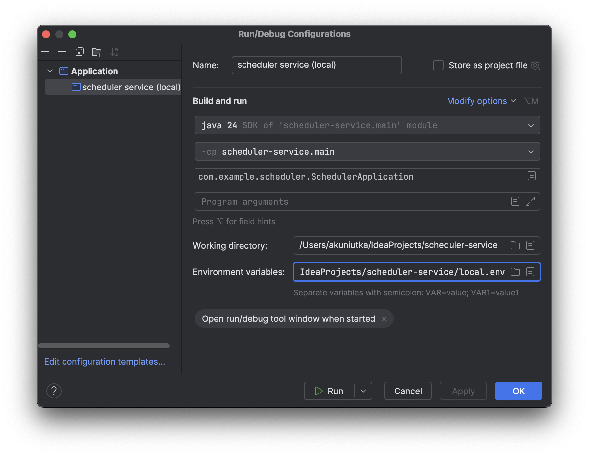
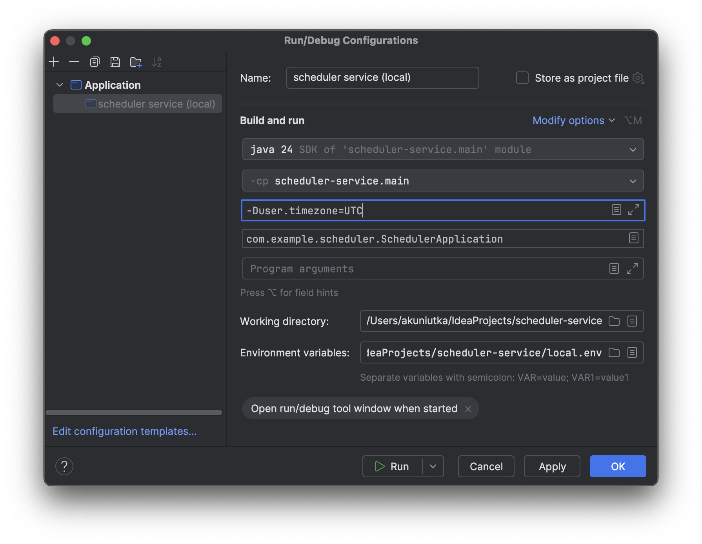

# Scheduler Service

Сервис для планирования встреч один-на-один и групповых встреч.

---

### Как запустить приложение локально

Для запуска приложения на локальном компьютере необходимо:
- активировать в приложении Spring-профиль `local` и,
- установить значения для переменных окружения, используемых приложением и Docker Compose (в Docker Compose 
разворачивается база данных).

> [!NOTE]
> Spring Boot позволяет активировать нужный Spring-профиль через переменную окружения, поэтому оба пункта можно 
> объединить в один. 

#### Переменные окружения для локального запуска

- `SPRING_PROFILES_ACTIVE` - Spring-профиль (`local`), если активируем его через переменную окружения.
- `SCHEDULER_DATABASE_NAME` - имя базы данных.
- `SCHEDULER_DATABASE_USERNAME` - имя пользователя, используемое для доступа к базе данных (не связано с пользователями 
приложения).
- `SCHEDULER_DATABASE_PASSWORD` - пароль для доступа к базе данных (также не связан с доступом в само приложение).
- `SCHEDULER_DATABASE_EXTERNAL_PORT` - порт на localhost, по которому доступна база данных (внутри Docker Compose 
база данных использует стандартный для PostgreSQL порт 5432, данная настройка определяет порт для доступа к 
базе ланных извне).
- `SCHEDULER_EXTERNAL_PORT` - порт на localhost, по которому доступно само приложение.
- `SCHEDULER_JWT_ACCESS_SECRET` - секретный ключ, используемый при генерации access token'ов (для создания ключа 
воспользуйтесь методом `main()` класса 
[`com.example.scheduler.infrastructure.util.SecretUtil`](src/main/java/com/example/scheduler/infrastructure/util/SecretUtil.java)).
- `SCHEDULER_JWT_REFRESH_SECRET` - секретный ключ, используемый при генерации refresh token'ов (аналогично см. метод
`main()` класса
[`com.example.scheduler.infrastructure.util.SecretUtil`](src/main/java/com/example/scheduler/infrastructure/util/SecretUtil.java)).
- `SCHEDULER_JWT_ACCESS_TOKEN_TTL` - срок действия access token'а в миллисекундах, рекомендуем установить равным 
3600000 (1 час).
- `SCHEDULER_JWT_REFRESH_TOKEN_TTL` - срок действия refresh token'а в миллисекундах, рекомендуем установить равным
86400000 (1 сутки).

> [!NOTE]
> Рекомендуем создать файл `local.env` и сохранить переменные окружения в нём. В IntelliJ IDEA есть возможность 
> [использовать](#как-подключить-файл-с-переменными-окружения-в-intellij-idea) этот файл при запуске приложения, а 
> Docker Compose подхватывает настройки из `local.env` автоматически.

#### Как подключить файл с переменными окружения в IntelliJ IDEA

Если переменные окружения сохранены в файле, путь к этому файлу можно указать в поле "Environment variables" 
диалогового окна "Run/Debug Configurations" (Run > Edit Configurations... > выбрать либо создать нужную конфигурацию > 
Modify options > Environment variables):



#### Как вернуть базу данных в исходное состояние

По умолчанию Docker Compose при завершении приложения останавливает контейнер с базой данных, но не удаляет его. Это 
позволяет сохранять состояние базы данных между перезапусками приложения. Если требуется очистить базу данных, выполните 
в терминале команду:

```bash
docker compose down
```

Docker Compose удалит текущий контейнер с базой данных и при следующем запуске приложения создаст базу данных заново.

#### Как синхронизировать часовой пояс базы данных и приложения

По умолчанию Docker Compose запускает контейнер с базой данных в часовом поясе UTC+0:

```
# SELECT now() AS now;
              now              
-------------------------------
 2025-07-20 10:01:14.574742+00
(1 row)
```

Чтобы приложение работало в одном часовом поясе с базой данных, рекомендуем при запуске приложения добавить для JVM 
ключ `user.timezone` с значением `UTC` (Run > Edit Configurations... > выбрать либо создать нужную
конфигурацию > Modify options > Add VM options):



---
