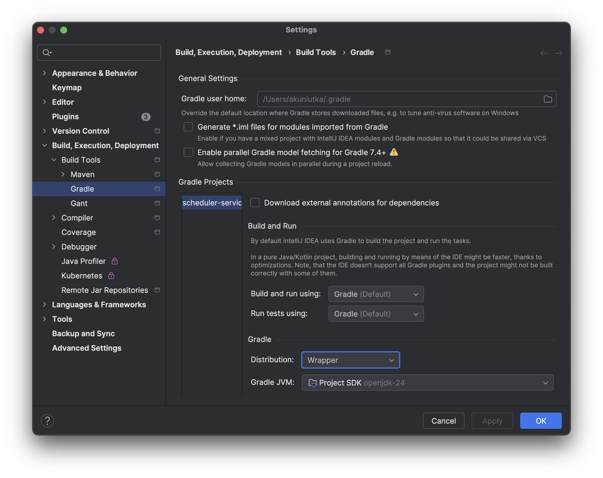
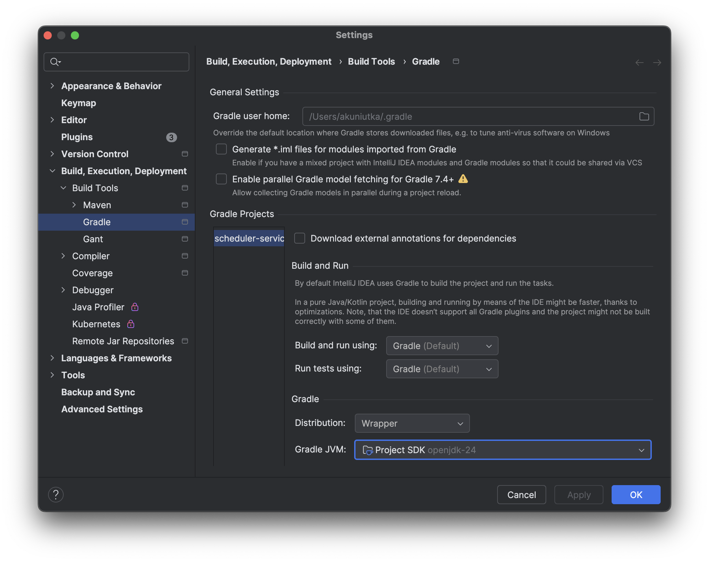
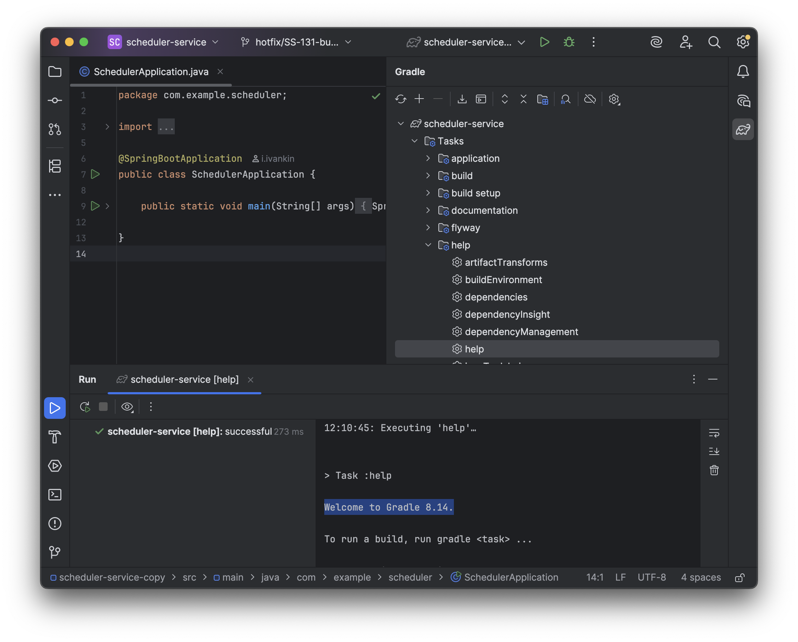

# Интеграция IntelliJ IDEA с Gradle

### Почему Gradle?

Gradle - инструмент нового поколения для сборки проектов на Java (и не только!). Основным его преимуществом является 
инкрементальная сборка, когда после изменений в коде перекомпилируются только нужные классы, — так пересборка проекта 
занимает меньше времени. Также Gradle позволяет для описания сборки вместо XML использовать Groovy либо Kotlin, делая
такое описание более лаконичным. Ещё одной фичей Gradle является [Gradle Wrapper](#что-такое-gradle-wrapper) - когда 
в репозиторий включается "обёртка" (wrapper) над Gradle, позволяющая всем разработчикам собирать проект с одной и 
той же версией Gradle. У Gradle есть и другие фичи, описание которых можно прочесть на 
[официальном сайте](https://gradle.org/features/).

### Что такое Gradle Wrapper?

Gradle Wrapper это набор из четырёх файлов:
- `gradle/wrapper/gradle-wrapper.jar` - содержит код для скачивания в кэш нужной версии Gradle.
- `gradle/wrapper/gradle-wrapper.properties` - хранит настройки: какую версию Gradle скачивать, откуда и т.д.
- `gradlew` - shell-скрипт (Linux и macOS) для запуска из кэша нужной версии Gradle.
- `gradlew.bat` - аналог `gradlew` для Windows

Все вместе они позволяют команде разработчиков использовать одинаковую версию Gradle и уменьшить вероятность ошибки, 
вызванной различиями в настройках окружения на разных компьютерах. Разработчику остаётся просто вместо команды `gradle` 
использовать команду `./gradlew` (или `gradlew.bat` для Windows), всё остальное обеспечит Gradle Wrapper.

### Как настроить IntelliJ на работу с Gradle Wrapper?

Для того, чтобы IntelliJ IDEA использовала Gradle Wrapper из репозитория, надо включить соответствующую настройку в
`IntelliJ IDEA > Settings... > Build, Execution, Deployment > Build Tools > Gradle > Distribution`:

И указать, что при запуске Gradle Wrapper должна использоваться та же версия Java, что и для самого проекта 
(`IntelliJ IDEA > Settings... > Build, Execution, Deployment > Build Tools > Gradle > Gradle JVM`):

Проверить, что IDEA использует нужную версию Gradle, можно с помощью таски `help` в панели Gradle:

